# 🌐 HTML & CSS Mini-Tasks — Comprehensive Practice Pack


A complete collection of **11 HTML & CSS tasks** designed to strengthen fundamentals in **HTML structure, form creation, debugging, styling, lists, tables, and semantic markup**.  
Screenshots and clean project structure are included for clarity.

---

## 📂 Project Structure

```
html-css-basics/
│
├── screenshots/        # Screenshots for each task (1.png → 11.b.png)
│
├── templates/          
│   ├── Question1.html
│   ├── Question2.html
│   ├── Question3.html
│   ├── styleQ3.css
│   ├── Question4.html
│   ├── Question5.html
│   ├── Question6.html
│   ├── Question7.html
│   ├── styleQ7.css
│   ├── Question8.html
│   ├── Question9.html
│   ├── Question10.html
│   ├── Question11.html
│   └── task.md         # Contains all original questions
│
├── LICENSE
└── README.md
```

---

## 📝 Task Overview

### **Q1 – Fix Bugs in HTML Snippet**
Basic bug‑fixing involving:
- Improper nesting  
- Unclosed tags  
- Incorrect attribute placements  

---

### **Q2 – Fix Bugs in Another HTML Snippet**
Similar debugging with structure correction and semantic fixes.

---

### **Q3 – Contact Us Form**
Creates a complete form containing:
- Name, Email, Subject, Message fields  
- Required validation  
- Styled using **styleQ3.css**

📸 *Screenshot:*  
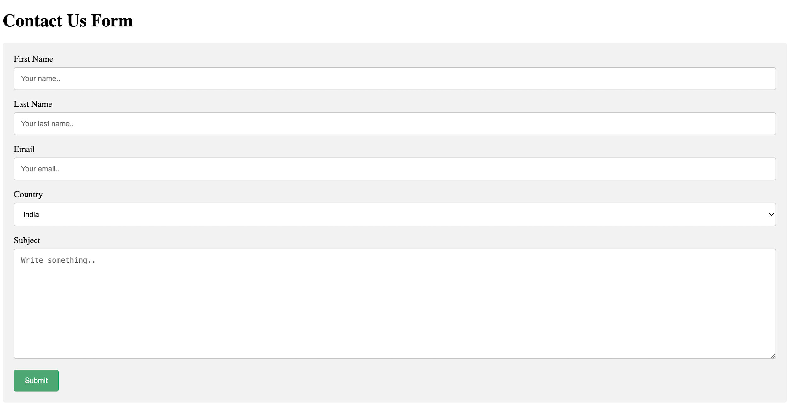

---

### **Q4 – Programming Languages & Databases List**
Nested lists covering:
- JS, Python, Java
- Frameworks (e.g., React, Django)
- Databases (MySQL, MongoDB)

---

### **Q5 – Open Google in New Tab**
Simple anchor-tag behavior using:

```html
<a href="https://google.com" target="_blank">Open Google</a>
```

---

### **Q6 – Employee Type Radio Buttons**
Two grouped radio buttons:
- Salaried  
- Own Business  

---

### **Q7 – Form UI Based on a Reference Image**
Recreates a complex form layout with custom styling in **styleQ7.css**.

📸 *Screenshot:*  
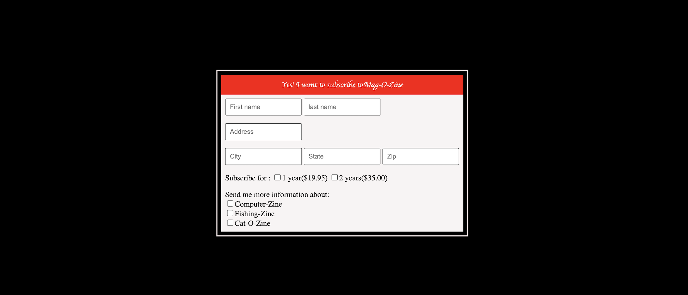

---

### **Q8 – Table Based on Reference Image**
Uses table tags `<table>`, `<tr>`, `<td>`, `<th>` to recreate a given design.

📸 *Screenshot:*  
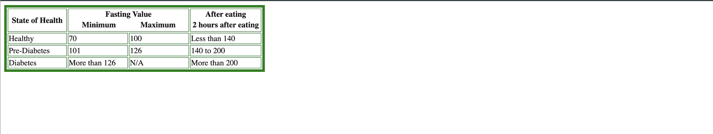

---

### **Q9 – Default Form Values**
Demonstrates placeholder/default values for all HTML input types.

---

### **Q10 – Highlight Text Without CSS**
Uses `<mark>` to highlight:  
**HTML & CSS is awesome**

---

### **Q11 – All Input Types Form**
Includes:
- text, password, radio, checkbox  
- color, date, time, file  
- range, number, search  
- textarea, dropdowns

📸 *Screenshot:*  
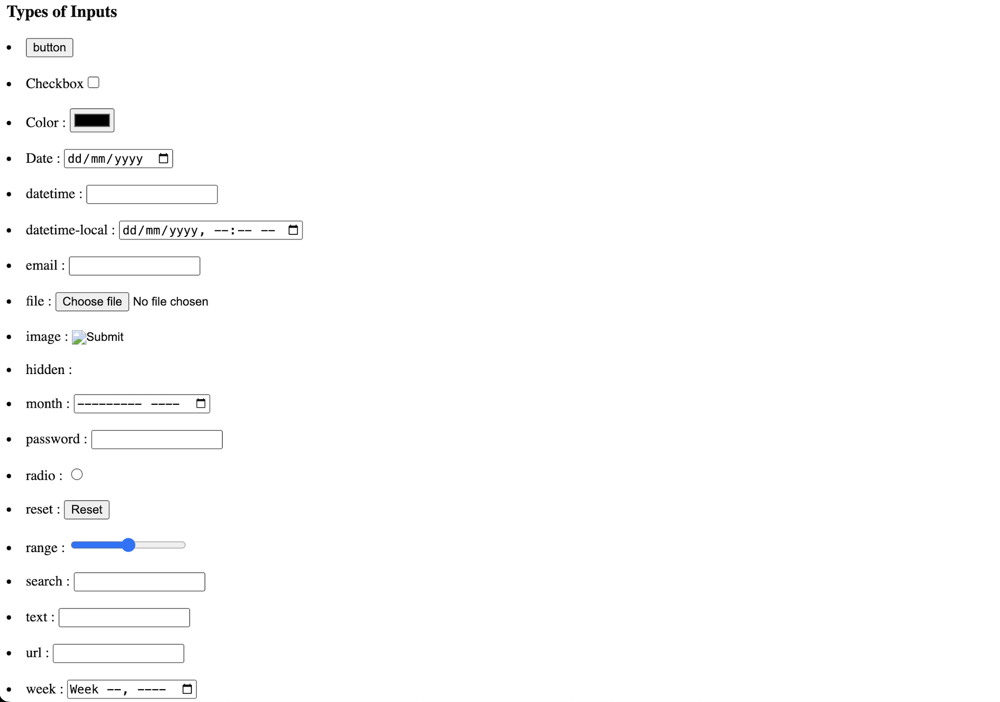

---

## 🖼 Screenshot Gallery (Grid View)

### **Q1 & Q2**
| Q1 | Q2 |
|----|----|
| 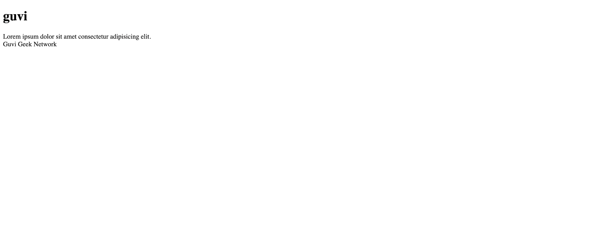 | 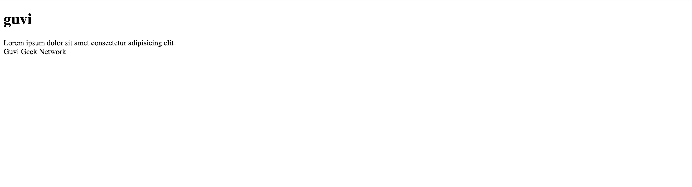 |

### **Q3 – Q6**
| Q3 | Q4 | Q5a | Q5b |
|----|----|------|------|
|  | 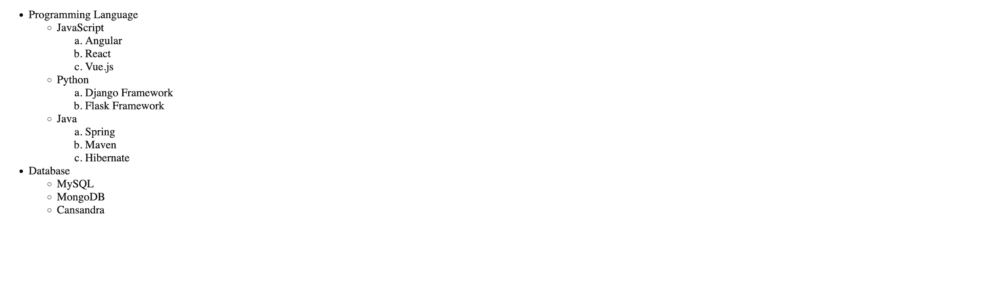 | 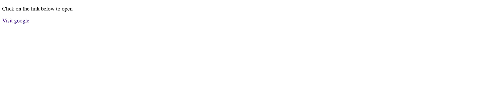 | 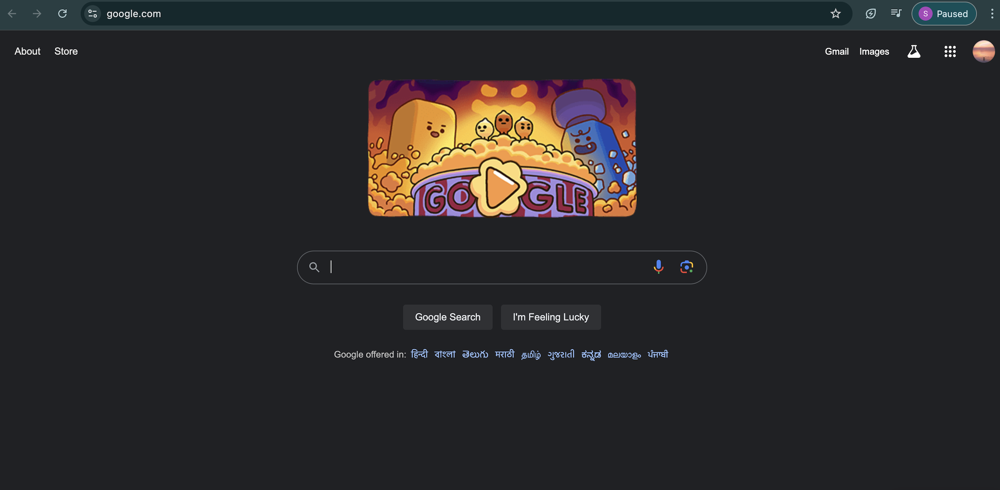 |

| Q6 |
|----|
| 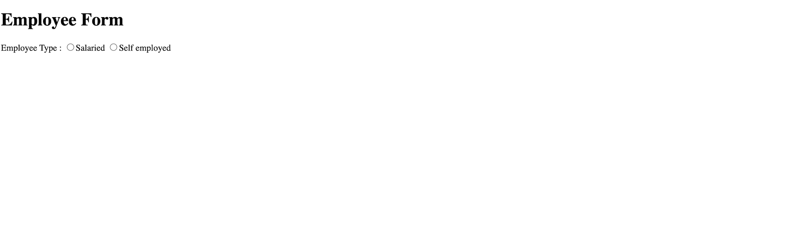 |

### **Q7 – Q11**
| Q7 | Q8 | Q9 | Q10 |
|----|----|-----|-----|
|  |  | 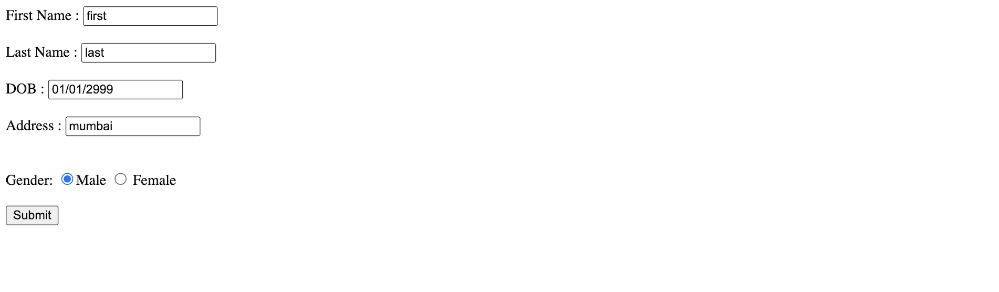 | 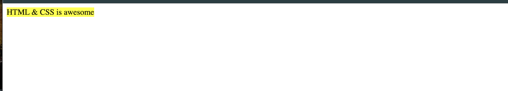 |

| Q11a | Q11b |
|-------|--------|
|  | 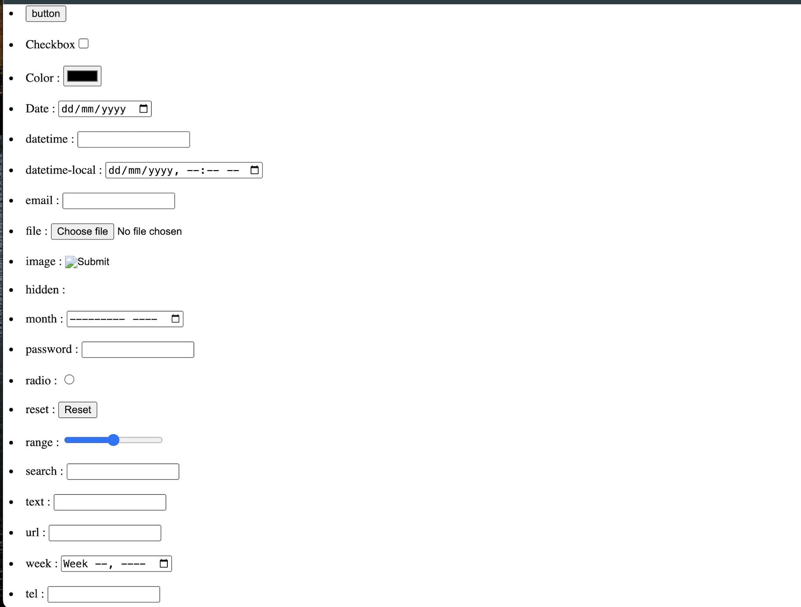 |

---

## ▶️ How to View the Tasks

### 1️⃣ Clone the Repository
```bash
git clone https://github.com/TheComputationalCore/html-css-mini-tasks.git
```

### 2️⃣ Open in Browser
Simply open any `QuestionX.html` file in a browser.

### 3️⃣ For Q3 & Q7
Ensure the CSS files `styleQ3.css` and `styleQ7.css` are in the same folder.

---

## 🛠 Tech Stack Used
- **HTML5**
- **CSS3**
- **Semantic Elements**
- **Form Validation**
- **Table & List Structures**

---

## 🏷 Topics
`html` • `css` • `forms` • `tables` • `lists` • `semantics` • `web-basics`

---

## 📜 License
This project is licensed under the **MIT License**.

